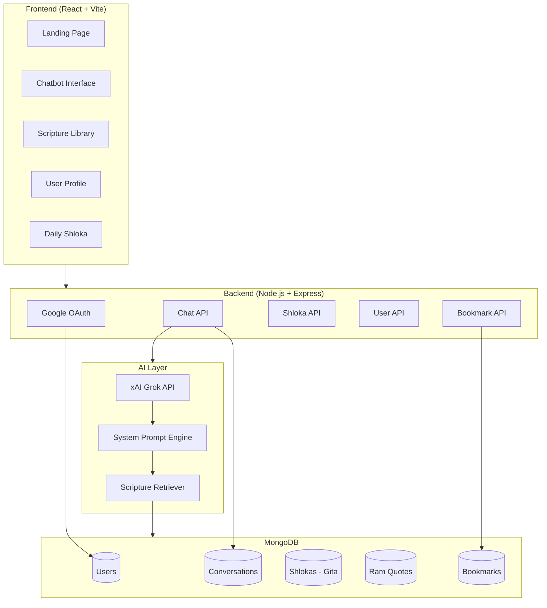

# Gitaarth AI — Ancient Wisdom for Modern Problems

A cosmic-themed spiritual platform featuring a divine chatbot that counsels users using authentic quotes from the **Bhagavad Gita** (Lord Krishna) and **Ramayana** (Lord Ram).

---

## Design Decisions Recap

| Decision | Choice |
|---|---|
| **Project Name** | Gitaarth AI |
| **Tagline** | Ancient Wisdom for Modern Problems |
| **Visual Theme** | Cosmic/Celestial — deep space, divine light rays, Vishwaroop grandeur |
| **Chat Entry** | Immediate — user types their problem directly |
| **Persona Switching** | Dynamic — chatbot switches between Krishna & Ram with visual indicators |
| **Krishna Responses** | Sanskrit shloka (Devanagari) → Translation → Chapter/Verse reference → Counseling |
| **Ram Responses** | Wisdom in user's language — no shlokas, natural narrative style |
| **Conversation Style** | Back-and-forth dialogue, one thoughtful response at a time |
| **Language** | User selects language before chatting |
| **Auth** | Google OAuth 2.0 |
| **Guest Mode** | Chat freely without login; sign in to save/bookmark/history |
| **Tech Stack** | React (Vite) + Node.js/Express + MongoDB + xAI Grok API |

---

## User Review Required

> [!IMPORTANT]
> **AI API Costs**: The xAI Grok API will be used for generating counseling responses. You'll need an xAI API key from https://console.x.ai/. Check current pricing and rate limits for production traffic.

> [!IMPORTANT]
> **Scripture Database**: I will seed the database with a curated collection of ~700 Bhagavad Gita shlokas (all 18 chapters) and ~200 key Ramayana quotes/teachings from Ram. The AI will pull from this verified database — never hallucinate quotes.

> [!WARNING]
> **MongoDB**: The plan uses MongoDB Atlas (cloud). You'll need to create a free cluster and provide the connection string. Alternatively, I can set it up with a local MongoDB instance for development.

---

## Open Questions

> [!IMPORTANT]
> **Language Options**: Which languages should be available at launch? Suggested: English, Hindi, Telugu, Tamil, Kannada, Sanskrit. Should I include all of these, or start with just English + Hindi?

> [!IMPORTANT]
> **Shloka Source**: I'll curate shlokas from publicly available, widely-accepted translations (e.g., Swami Sivananda, Swami Chinmayananda). Any preference on which translation/commentary to use?

> [!NOTE]
> **Deployment**: Where do you plan to deploy this? Vercel (frontend) + Render/Railway (backend) is a solid free-tier option. Or do you have other preferences?

---

## Architecture Overview



---

## Project Structure

```
BhagavadGita for all/
├── frontend/                    # React (Vite) app
│   ├── public/
│   │   ├── favicon.svg
│   │   └── assets/
│   │       ├── krishna-avatar.png
│   │       ├── ram-avatar.png
│   │       └── cosmic-bg.jpg
│   ├── src/
│   │   ├── main.jsx
│   │   ├── App.jsx
│   │   ├── index.css            # Global styles + design system
│   │   ├── components/
│   │   │   ├── Navbar.jsx
│   │   │   ├── ChatBubble.jsx       # Message bubble with persona styling
│   │   │   ├── ShlokaCard.jsx       # Sanskrit shloka display component
│   │   │   ├── PersonaIndicator.jsx # Krishna/Ram avatar + name switcher
│   │   │   ├── LanguageSelector.jsx # Language picker modal
│   │   │   ├── DailyShloka.jsx      # Daily shloka widget
│   │   │   ├── BookmarkButton.jsx   # Save/bookmark toggle
│   │   │   ├── ShareButton.jsx      # Social media share
│   │   │   ├── CosmicBackground.jsx # Animated space/celestial background
│   │   │   └── AuthButton.jsx       # Google sign-in button
│   │   ├── pages/
│   │   │   ├── Home.jsx            # Landing page with Daily Shloka
│   │   │   ├── Chat.jsx            # Main chatbot page
│   │   │   ├── Library.jsx         # Scripture library browser
│   │   │   ├── Profile.jsx         # User profile, history, bookmarks
│   │   │   └── About.jsx           # About the project
│   │   ├── context/
│   │   │   ├── AuthContext.jsx      # Google OAuth state
│   │   │   └── ChatContext.jsx      # Chat session state
│   │   ├── hooks/
│   │   │   ├── useChat.js           # Chat logic hook
│   │   │   └── useAuth.js           # Auth helper hook
│   │   └── utils/
│   │       ├── api.js               # Axios API client
│   │       └── constants.js         # App-wide constants
│   ├── package.json
│   └── vite.config.js
│
├── backend/                     # Node.js + Express API
│   ├── server.js                # Entry point
│   ├── config/
│   │   ├── db.js                # MongoDB connection
│   │   ├── passport.js          # Google OAuth config
│   │   └── grok.js              # xAI Grok API config
│   ├── models/
│   │   ├── User.js              # User schema
│   │   ├── Conversation.js      # Chat history schema
│   │   ├── Shloka.js            # Gita shlokas schema
│   │   ├── RamQuote.js          # Ramayana quotes schema
│   │   └── Bookmark.js          # User bookmarks schema
│   ├── routes/
│   │   ├── auth.js              # OAuth routes
│   │   ├── chat.js              # Chat API routes
│   │   ├── shlokas.js           # Shloka/library routes
│   │   └── user.js              # User profile/bookmarks routes
│   ├── controllers/
│   │   ├── chatController.js    # Chat logic + xAI Grok integration
│   │   ├── shlokaController.js  # Scripture retrieval
│   │   └── userController.js    # User operations
│   ├── middleware/
│   │   ├── auth.js              # JWT/session verification
│   │   └── guestMode.js         # Allow guest access with limits
│   ├── services/
│   │   ├── grokService.js       # xAI Grok API wrapper
│   │   ├── scriptureService.js  # RAG: retrieve relevant shlokas
│   │   └── promptEngine.js      # System prompt builder
│   ├── seeds/
│   │   ├── gitaShlokas.json     # All 700 Gita shlokas
│   │   └── ramQuotes.json       # 200+ Ram quotes from Ramayana
│   ├── package.json
│   └── .env.example             # Template for API keys
│
└── README.md
```

---

## Proposed Changes

### Phase 1: Foundation & Design System
> Build the project skeleton, design system, and cosmic UI foundation.

#### [NEW] Project initialization
- Initialize React (Vite) frontend with `npx create-vite`
- Initialize Node.js backend with Express
- Set up project structure, ESLint, and dependencies

#### [NEW] [index.css](file:///home/abithashenvari2703/BhagavadGita%20for%20all/frontend/src/index.css)
- Complete design system with cosmic/celestial theme
- CSS custom properties: deep space colors, divine gold accents, celestial gradients
- Typography: Google Fonts (Cinzel for headings — regal/divine, Inter for body)
- Animations: floating particles, divine glow effects, subtle pulsing light
- Responsive breakpoints

#### [NEW] [CosmicBackground.jsx](file:///home/abithashenvari2703/BhagavadGita%20for%20all/frontend/src/components/CosmicBackground.jsx)
- Animated deep space background with stars, nebula effects
- Subtle floating particles (divine light orbs)
- Canvas-based or CSS animation for performance

---

### Phase 2: Landing Page & Navigation

#### [NEW] [Navbar.jsx](file:///home/abithashenvari2703/BhagavadGita%20for%20all/frontend/src/components/Navbar.jsx)
- Glassmorphic navigation bar with cosmic theme
- Links: Home, Chat, Library, Profile
- Google sign-in button (or user avatar when logged in)
- Mobile-responsive hamburger menu

#### [NEW] [Home.jsx](file:///home/abithashenvari2703/BhagavadGita%20for%20all/frontend/src/pages/Home.jsx)
- Hero section: "Gitaarth AI" title with cosmic divine light effect
- Tagline: "Ancient Wisdom for Modern Problems"
- CTA button: "Seek Divine Guidance" → navigates to Chat
- Daily Shloka widget (random shloka that changes daily)
- Brief feature showcase (Chat, Library, Bookmarks)
- Footer with credits

#### [NEW] [DailyShloka.jsx](file:///home/abithashenvari2703/BhagavadGita%20for%20all/frontend/src/components/DailyShloka.jsx)
- Fetches a daily shloka from the backend
- Displays Sanskrit text + translation + chapter reference
- Subtle celestial card design with glow border

---

### Phase 3: The Divine Chatbot (Core Feature)

#### [NEW] [Chat.jsx](file:///home/abithashenvari2703/BhagavadGita%20for%20all/frontend/src/pages/Chat.jsx)
- Language selector modal on first visit
- Chat interface with cosmic-themed input area
- Message list with scrollable history
- Typing indicator when AI is "thinking"
- Persona indicator showing current deity (Krishna/Ram)

#### [NEW] [ChatBubble.jsx](file:///home/abithashenvari2703/BhagavadGita%20for%20all/frontend/src/components/ChatBubble.jsx)
- **User messages**: Clean, right-aligned bubbles
- **Krishna messages**: Golden-themed left-aligned bubbles with Krishna avatar
  - Includes `ShlokaCard` component inline for Sanskrit shlokas
  - Chapter/verse reference badge
- **Ram messages**: Blue/serene-themed left-aligned bubbles with Ram avatar
  - Wisdom text without shloka formatting

#### [NEW] [ShlokaCard.jsx](file:///home/abithashenvari2703/BhagavadGita%20for%20all/frontend/src/components/ShlokaCard.jsx)
- Sanskrit text in Devanagari (elegant serif font like "Noto Sans Devanagari")
- Translation in user's selected language
- Chapter name + verse number badge (e.g., "अध्याय 2 - सांख्ययोग, श्लोक 47")
- Bookmark button on the card
- Share button

#### [NEW] [PersonaIndicator.jsx](file:///home/abithashenvari2703/BhagavadGita%20for%20all/frontend/src/components/PersonaIndicator.jsx)
- Visual indicator showing which deity is currently speaking
- Avatar image + name + subtle glow effect
- Smooth transition animation when persona switches

#### [NEW] [LanguageSelector.jsx](file:///home/abithashenvari2703/BhagavadGita%20for%20all/frontend/src/components/LanguageSelector.jsx)
- Modal/overlay that appears before first chat
- Language grid with flags/icons
- Saves preference to localStorage (guest) or user profile (logged in)

---

### Phase 4: Backend API & Database

#### [NEW] [server.js](file:///home/abithashenvari2703/BhagavadGita%20for%20all/backend/server.js)
- Express server with CORS, JSON parsing, sessions
- Route mounting for auth, chat, shlokas, user
- MongoDB connection on startup

#### [NEW] MongoDB Models
- **User**: googleId, name, email, avatar, language preference, createdAt
- **Conversation**: userId (nullable for guests), messages array, persona per message, createdAt
- **Shloka**: chapter, verse, sanskritText, translations (multi-language map), chapterName, keywords/tags
- **RamQuote**: quote text, context (which story/event), translations, keywords/tags
- **Bookmark**: userId, type (shloka/chatMessage), referenceId, createdAt

#### [NEW] [chatController.js](file:///home/abithashenvari2703/BhagavadGita%20for%20all/backend/controllers/chatController.js)
- Receives user message + conversation history + language preference
- Calls `scriptureService` to find relevant shlokas/quotes based on keywords
- Builds context-rich prompt with retrieved scriptures
- Sends to xAI Grok API via `grokService`
- Parses response to extract: persona (Krishna/Ram), counseling text, shloka references
- Returns structured response to frontend

#### [NEW] [promptEngine.js](file:///home/abithashenvari2703/BhagavadGita%20for%20all/backend/services/promptEngine.js)
- System prompt that instructs Grok to act as a divine counselor
- Includes rules: use only provided shlokas, attribute correctly, switch personas naturally
- **Language Rule**: If language is Hindi, the AI MUST respond in **Hinglish** (Hindi language written in the English alphabet) and understand user inputs written in Hinglish.
- Structures response format: `{ persona, message, shloka?, chapter?, verse? }`
- Injects retrieved scripture context into each prompt

#### [NEW] [scriptureService.js](file:///home/abithashenvari2703/BhagavadGita%20for%20all/backend/services/scriptureService.js)
- Keyword extraction from user message
- MongoDB text search + tag matching on Shloka and RamQuote collections
- Returns top 3-5 relevant scriptures for prompt context
- Ensures variety — doesn't repeat recently used shlokas in the same conversation

---

### Phase 5: Scripture Database & Seeding

#### [NEW] [gitaShlokas.json](file:///home/abithashenvari2703/BhagavadGita%20for%20all/backend/seeds/gitaShlokas.json)
- All 18 chapters of the Bhagavad Gita
- Each shloka: chapter number, verse number, chapter name (Sanskrit + English), Sanskrit text, English translation, Hindi translation, keywords/tags for search
- ~700 shlokas total

#### [NEW] [ramQuotes.json](file:///home/abithashenvari2703/BhagavadGita%20for%20all/backend/seeds/ramQuotes.json)
- Key teachings and dialogues of Lord Ram from Valmiki Ramayana
- Each quote: original text, context (event/story), English translation, Hindi translation, keywords/tags
- ~200 curated quotes

#### [NEW] Seed script
- `npm run seed` command to populate MongoDB with scripture data

---

### Phase 6: Authentication

#### [NEW] Google OAuth integration
- Passport.js with Google strategy
- JWT token generation after successful OAuth
- Session management for logged-in users
- Guest middleware for unauthenticated access

---

### Phase 7: Scripture Library

#### [NEW] [Library.jsx](file:///home/abithashenvari2703/BhagavadGita%20for%20all/frontend/src/pages/Library.jsx)
- Browse Gita by chapter (accordion/expandable sections)
- Browse Ramayana quotes by story/event category
- Search functionality across all scriptures
- Each shloka/quote rendered as a beautiful card with bookmark option
- Cosmic-themed grid layout

---

### Phase 8: User Profile & History

#### [NEW] [Profile.jsx](file:///home/abithashenvari2703/BhagavadGita%20for%20all/frontend/src/pages/Profile.jsx)
- User info (from Google profile)
- Conversation history list (clickable to re-read past sessions)
- Bookmarked shlokas and responses
- Language preference setting
- Sharing options for favorite quotes

---

### Phase 9: Social Sharing

#### [NEW] [ShareButton.jsx](file:///home/abithashenvari2703/BhagavadGita%20for%20all/frontend/src/components/ShareButton.jsx)
- Generate shareable quote cards (canvas-based image generation)
- Share to WhatsApp, Twitter/X, Instagram (copy), Facebook
- Deep link back to the specific shloka on the website

---

## Visual Design Direction

### Color Palette
| Token | Value | Usage |
|---|---|---|
| `--cosmic-void` | `#0a0a1a` | Deep space background |
| `--nebula-purple` | `#1a0533` | Secondary background |
| `--divine-gold` | `#ffd700` | Krishna accents, highlights |
| `--celestial-blue` | `#4169e1` | Ram accents |
| `--starlight` | `#e8e8ff` | Primary text |
| `--cosmic-glow` | `rgba(255, 215, 0, 0.3)` | Glow effects |
| `--ram-glow` | `rgba(65, 105, 225, 0.3)` | Ram glow effects |
| `--sacred-gradient` | `linear-gradient(135deg, #0a0a1a, #1a0533, #0d1b3e)` | Page backgrounds |

### Typography
- **Headings**: Cinzel (regal, divine authority)
- **Body**: Inter (clean, modern readability)
- **Sanskrit**: Noto Sans Devanagari (authentic script rendering)

### Key Visual Elements
- ✨ Floating star particles on all pages
- 🌌 Deep space gradient backgrounds
- 💫 Divine golden glow on Krishna elements
- 🔵 Serene blue aura on Ram elements
- 🔮 Glassmorphic cards and panels
- ⚡ Subtle light ray animations

---

## Verification Plan

### Automated Tests
- Backend API tests: chat endpoint, shloka retrieval, auth flow
- Frontend component tests: ChatBubble renders correctly for both personas
- Scripture database validation: all shlokas have required fields

### Manual Verification
- Test full chat flow: user types problem → AI responds with correct persona + shloka
- Verify shloka accuracy: spot-check 20 random shlokas against source texts
- Test guest mode → sign in → bookmark flow
- Test language switching mid-session
- Mobile responsiveness on iPhone/Android screen sizes
- Visual review of cosmic theme, animations, and persona transitions

### Development Server
```bash
# Frontend
cd frontend && npm run dev    # localhost:5173

# Backend
cd backend && npm run dev     # localhost:5000
```

---

## Implementation Order

```mermaid
gantt
    title Gitaarth AI Build Phases
    dateFormat  X
    axisFormat %s

    section Foundation
    Project Setup & Design System     :1, 2
    Cosmic Background & Animations    :2, 3

    section Frontend Core
    Landing Page (Home)               :3, 4
    Navbar & Routing                  :3, 4
    Chat Interface UI                 :4, 6

    section Backend Core
    Express Server & MongoDB          :4, 5
    Scripture Database & Seeding      :5, 6
    Gemini AI Integration             :6, 8

    section Features
    Google OAuth                      :7, 8
    Scripture Library                 :8, 9
    User Profile & History            :9, 10
    Bookmarks & Social Sharing        :10, 11
    Polish & Testing                  :11, 12
```



> [!TIP]
> I'll build this in phases so you can see progress at every step. Phase 1-3 (frontend UI) will be visually testable immediately, and Phase 4-5 (backend + AI) will bring it to life.
